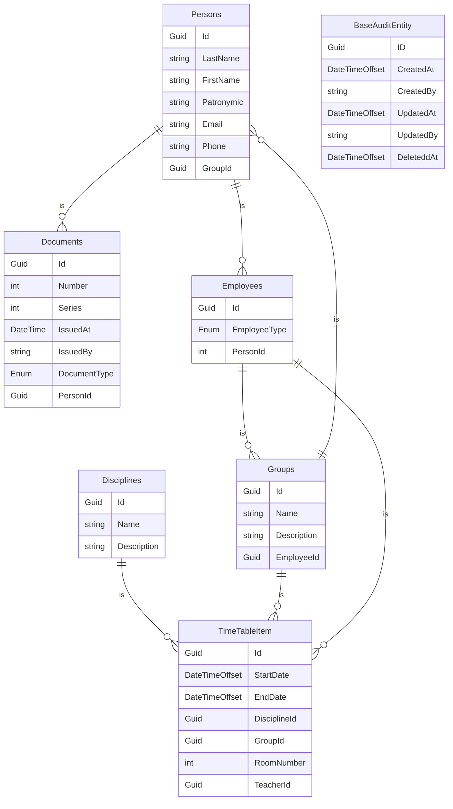

# TimeTable203
Расписание уроков

## Definition of Ready
1. Выбрать предметную область
2. Проработать бизнес сценарий
3. Охарактеризовать сущности бизнес сценария (минимум 6 сущности)
4. Описать схему взаимодействия сущностей

## Definition of Done
1. Разработать архитектуру приложения (UI\API, сервисы, контекст, репозитории)
2. Создать WebApi приложение по указанной архитектуре
3. Код написан по общепринятой конвенции [Code Syntax Style](https://www.jetbrains.com/help/rider/Code_Syntax_Style.html)
4. Создать CRUD контроллеры на каждую сущность
5. Разработать Unit-тесты сервисов, репозиториев, валидаторов
6. Разработать интеграционные тесты
7. В readme.md файле описать проделанную работу
   - ФИО и группа
   - Тема задания
   - Пример реального бизнес сценария (картинка ведомости\накладной\справки и т.п.)
   - Блок-схема [mermaid](http://mermaid.js.org/) взаимодействия сущностей
8. Созданы Issues для выполняемых задач
9. Созданы Pull requests для выполняемых задач
10. Работа по GitHub Flow
11. Ветка main защищена

## Схема базы данных

